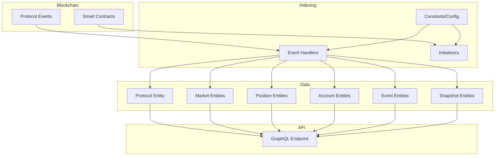
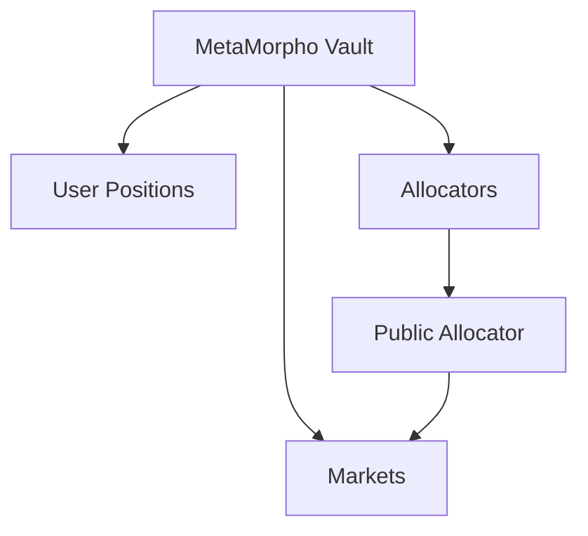
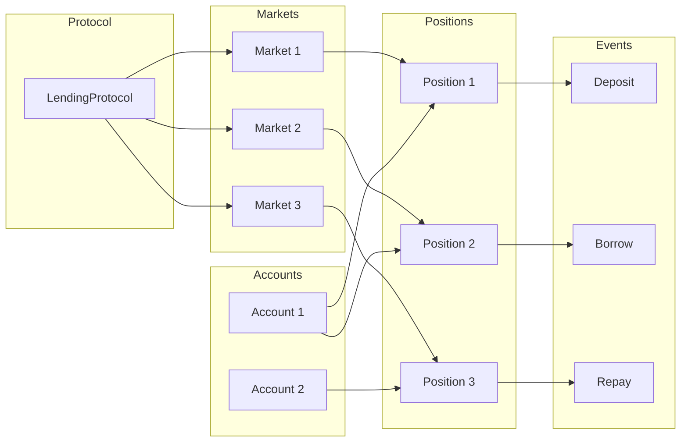

# System Patterns: Morpho Blue Subgraph

## System Architecture

The Morpho Blue subgraph follows a multi-layered architecture designed to index and organize lending protocol data:

## Key Technical Decisions

1. **Entity Relationship Model**: The subgraph uses a comprehensive entity model to represent the protocol components:
   - `LendingProtocol`: Top-level entity representing the entire protocol
   - `Market`: Represents individual lending/borrowing markets
   - `Position`: Represents user positions (supply, borrow, collateral)
   - `Account`: Represents user accounts interacting with the protocol
   - Events (`Deposit`, `Withdraw`, etc.): Represent user actions
   - MetaMorpho entities: Specialized entities for the MetaMorpho vault system

2. **Event-Driven Architecture**: The subgraph processes blockchain events to update entity states:
   - Event handlers listen for and process specific protocol events
   - Each event updates relevant entities and their relationships
   - Time-based snapshots are generated for historical analysis

3. **Snapshotting System**: Implements multiple snapshot types:
   - Daily and hourly snapshots for metrics
   - Position snapshots for position changes
   - Protocol-level and market-level snapshots

4. **Oracle Integration**: Uses Chainlink oracles for price data:
   - Tracks oracle addresses and updates
   - Maintains price history for assets
   - Converts token amounts to USD values

## Design Patterns

### Entity Inheritance Pattern
- Uses GraphQL interfaces for shared fields
- `Event` interface implemented by concrete event types
- `Protocol` interface implemented by `LendingProtocol`

### Composite Entity Pattern
- Complex entities like `Market` contain references to other entities (Token, Oracle)
- Many-to-many relationships managed through collections and derivations

### Time-Series Data Pattern
- Daily/hourly snapshots for time-series analysis
- Consistent timestamps and period markers
- Cumulative and period-specific metrics

### Transactional Event Pattern
- Each blockchain transaction mapped to typed event entities
- Events linked to affected positions and accounts
- Complete historical record of all protocol interactions

### Helper Entity Pattern
- Uses helper entities like `_MarketList`, `_PositionCounter` for internal operations
- Maintains counters and indices for efficient entity creation

## MetaMorpho Integration

The subgraph includes specialized handling for the MetaMorpho vault system:

Key components:
- **MetaMorpho Vaults**: Aggregate user funds into a single vault
- **MetaMorpho Markets**: Markets that vaults interact with
- **Allocators**: Entities that determine capital allocation
- **Public Allocator**: Special allocator allowing public participation

## Component Relationships

## Technical Implementation Details

### Price Feed System
The subgraph implements a sophisticated price feed system using Chainlink oracles:
- Oracle proxies tracked with their aggregator implementations
- Price updates recorded with timestamps
- Price conversion utils for accurate USD calculations

### Interest Rate Calculations
Interest rates are tracked and calculated through:
- Market interest rate models (IRMs)
- Supply and borrow indices for each market
- APR/APY calculations using these indices

### Share-based Accounting
The system uses share-based accounting for:
- User positions in markets
- MetaMorpho vault participation 
- Proper interest accrual

### Event Handler Implementation
Events are processed through specialized handlers that:
1. Identify relevant entities
2. Update entity states
3. Create related entities if needed
4. Record event specifics
5. Update counters and metrics
